# Pele QA: every diagram type

One fence per diagram type Pele supports, plus an invalid fence and a long diagram. Open this note in the app to QA the Mermaid widget.

## Flowchart

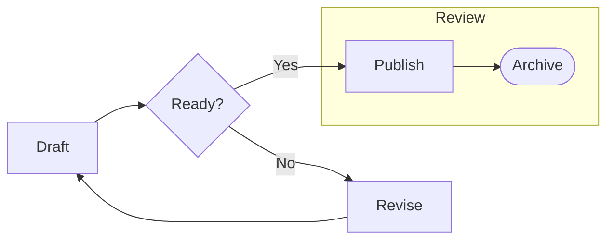
```mermaid
flowchart LR
  A[Draft] --> B{Ready?}
  B -- Yes --> C[Publish]
  B -- No --> D[Revise]
  D --> A
  subgraph Review
    C --> E([Archive])
  end
```

## Sequence

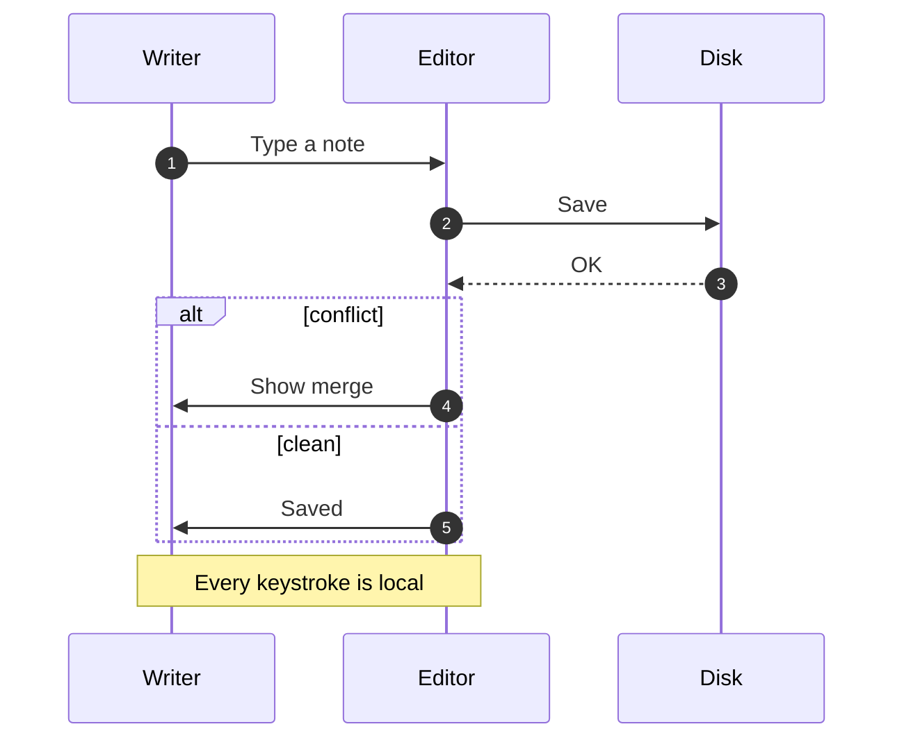
```mermaid
sequenceDiagram
  autonumber
  participant W as Writer
  participant E as Editor
  participant D as Disk
  W->>E: Type a note
  E->>D: Save
  D-->>E: OK
  alt conflict
    E->>W: Show merge
  else clean
    E->>W: Saved
  end
  Note over W,E: Every keystroke is local
```

## Class

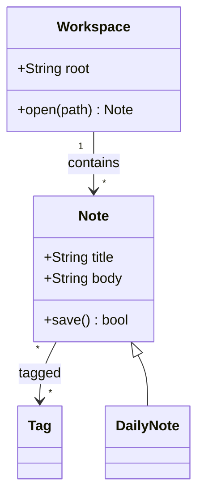
```mermaid
classDiagram
  class Note {
    +String title
    +String body
    +save() bool
  }
  class Workspace {
    +String root
    +open(path) Note
  }
  class Tag
  Workspace "1" --> "*" Note : contains
  Note "*" --> "*" Tag : tagged
  Note <|-- DailyNote
```

## State

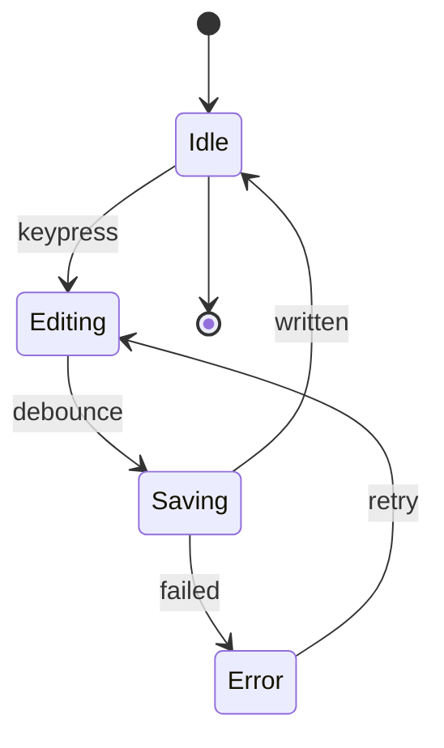
```mermaid
stateDiagram-v2
  [*] --> Idle
  Idle --> Editing : keypress
  Editing --> Saving : debounce
  Saving --> Idle : written
  Saving --> Error : failed
  Error --> Editing : retry
  Idle --> [*]
```

## Entity relationship

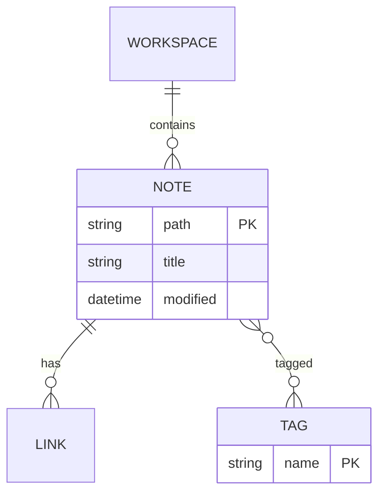
```mermaid
erDiagram
  WORKSPACE ||--o{ NOTE : contains
  NOTE ||--o{ LINK : has
  NOTE }o--o{ TAG : tagged
  NOTE {
    string path PK
    string title
    datetime modified
  }
  TAG {
    string name PK
  }
```

## Gantt

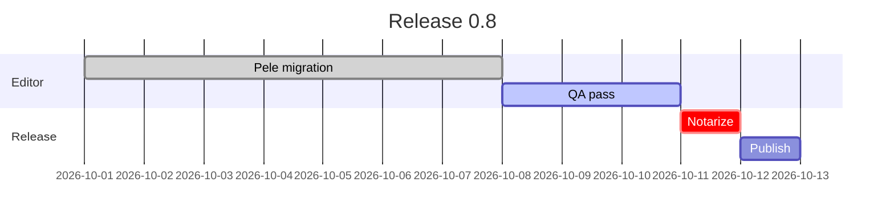
```mermaid
gantt
  title Release 0.8
  dateFormat YYYY-MM-DD
  section Editor
    Pele migration   :done, a1, 2026-10-01, 7d
    QA pass          :active, a2, after a1, 3d
  section Release
    Notarize         :crit, b1, after a2, 1d
    Publish          :b2, after b1, 1d
```

## Pie

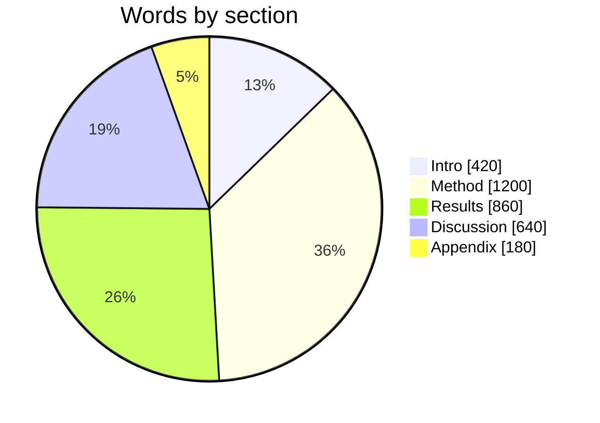
```mermaid
pie showData
  title Words by section
  "Intro" : 420
  "Method" : 1200
  "Results" : 860
  "Discussion" : 640
  "Appendix" : 180
```

## User journey

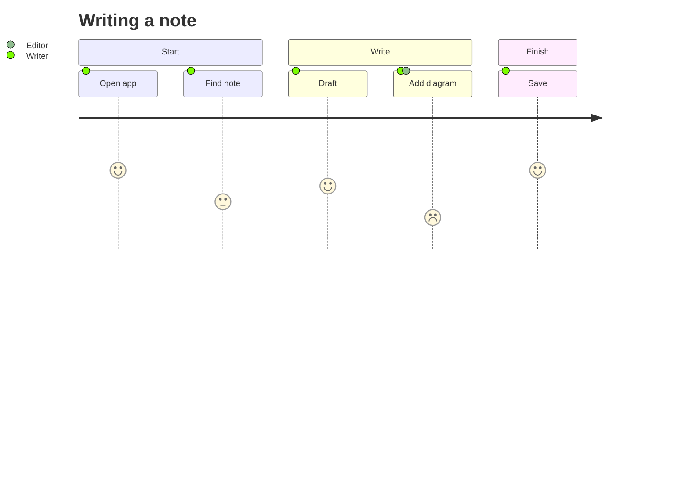
```mermaid
journey
  title Writing a note
  section Start
    Open app: 5: Writer
    Find note: 3: Writer
  section Write
    Draft: 4: Writer
    Add diagram: 2: Writer, Editor
  section Finish
    Save: 5: Writer
```

## Git graph

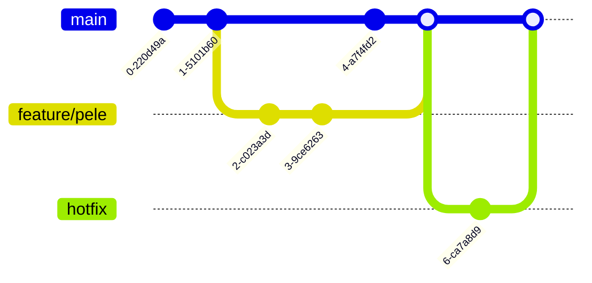
```mermaid
gitGraph
  commit
  commit
  branch feature/pele
  checkout feature/pele
  commit
  commit
  checkout main
  commit
  merge feature/pele
  branch hotfix
  commit
  checkout main
  merge hotfix
```

## Mindmap

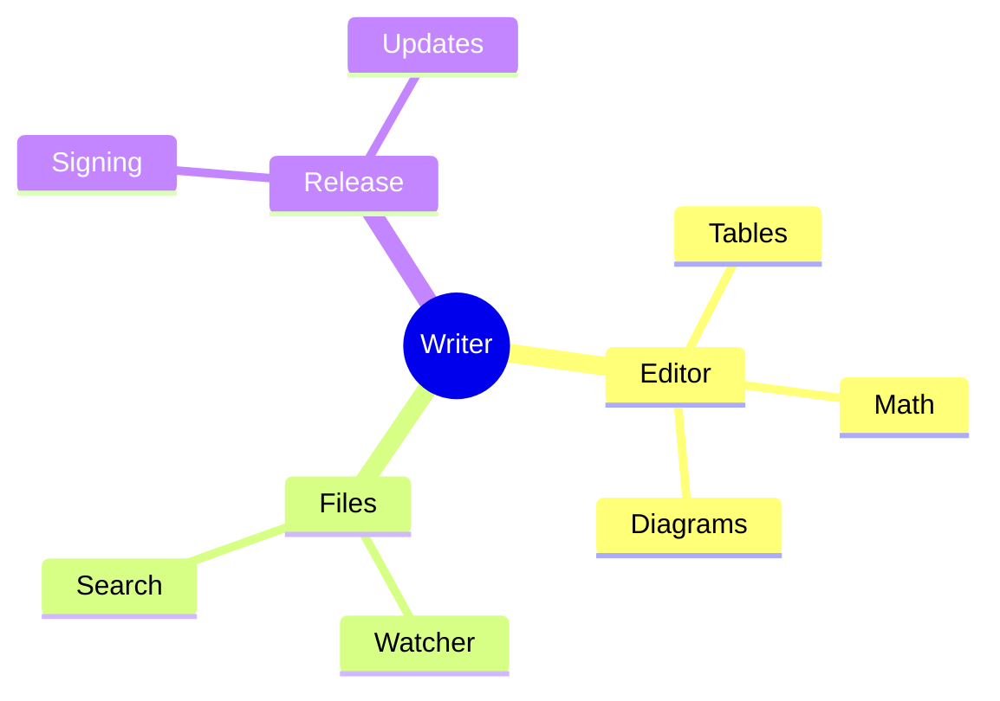
```mermaid
mindmap
  root((Writer))
    Editor
      Tables
      Math
      Diagrams
    Files
      Watcher
      Search
    Release
      Signing
      Updates
```

## Timeline

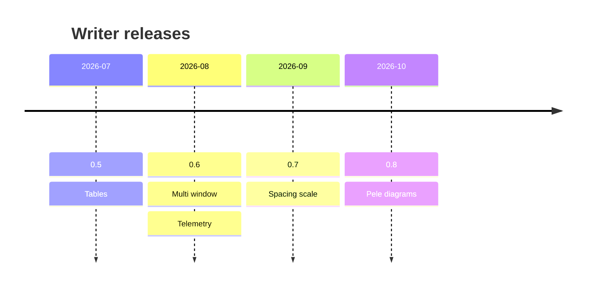
```mermaid
timeline
  title Writer releases
  2026-07 : 0.5 : Tables
  2026-08 : 0.6 : Multi window : Telemetry
  2026-09 : 0.7 : Spacing scale
  2026-10 : 0.8 : Pele diagrams
```

## Quadrant chart

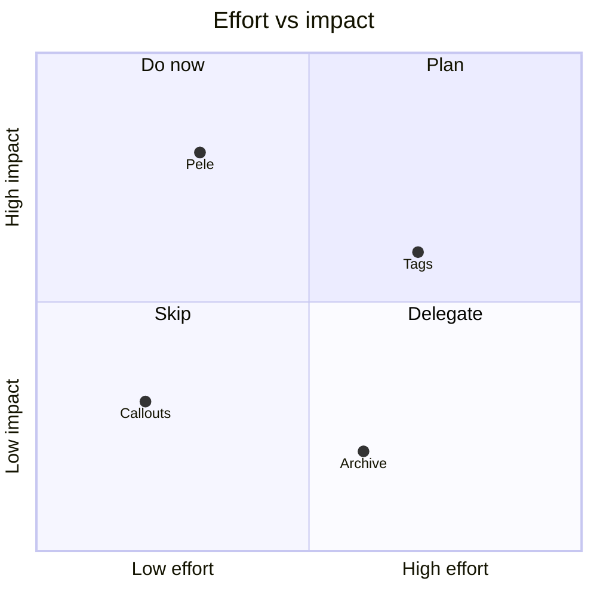
```mermaid
quadrantChart
  title Effort vs impact
  x-axis Low effort --> High effort
  y-axis Low impact --> High impact
  quadrant-1 Plan
  quadrant-2 Do now
  quadrant-3 Skip
  quadrant-4 Delegate
  Pele: [0.3, 0.8]
  Tags: [0.7, 0.6]
  Archive: [0.6, 0.2]
  Callouts: [0.2, 0.3]
```

## XY chart

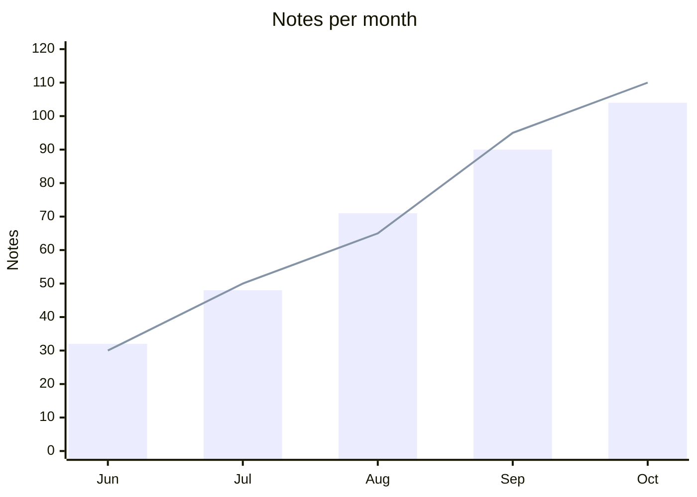
```mermaid
xychart-beta
  title "Notes per month"
  x-axis [Jun, Jul, Aug, Sep, Oct]
  y-axis "Notes" 0 --> 120
  bar [32, 48, 71, 90, 104]
  line [30, 50, 65, 95, 110]
```

## Sankey

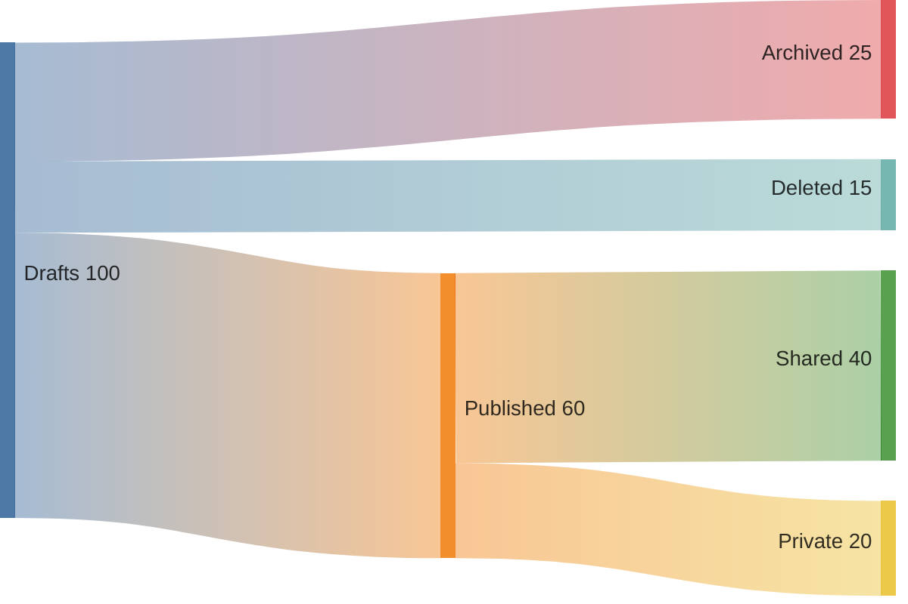
```mermaid
sankey-beta
Drafts,Published,60
Drafts,Archived,25
Drafts,Deleted,15
Published,Shared,40
Published,Private,20
```

## Block

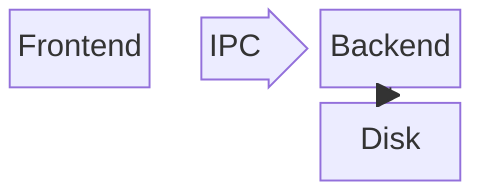
```mermaid
block-beta
  columns 3
  Frontend blockArrow<["IPC"]>(right) Backend
  space:2 Disk
  Backend --> Disk
```

## Architecture

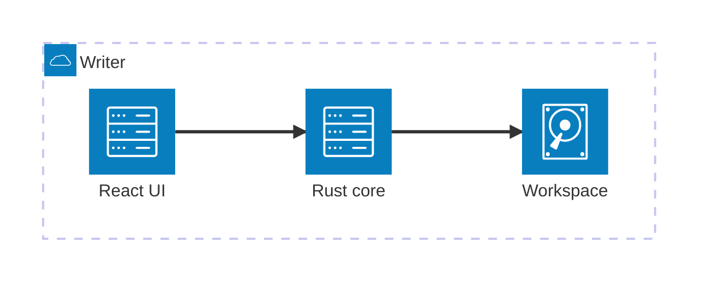
```mermaid
architecture-beta
  group app(cloud)[Writer]
  service ui(server)[React UI] in app
  service core(server)[Rust core] in app
  service disk(disk)[Workspace] in app
  ui:R --> L:core
  core:R --> L:disk
```

## Kanban

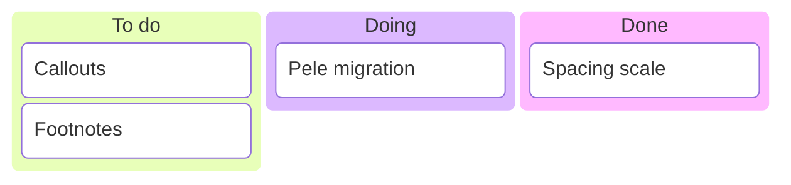
```mermaid
kanban
  todo[To do]
    t1[Callouts]
    t2[Footnotes]
  doing[Doing]
    d1[Pele migration]
  done[Done]
    f1[Spacing scale]
```

## Requirement

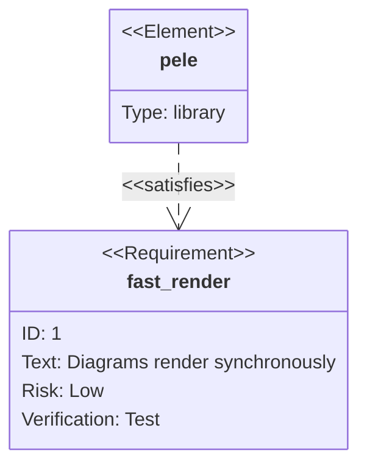
```mermaid
requirementDiagram
  requirement fast_render {
    id: 1
    text: Diagrams render synchronously
    risk: low
    verifymethod: test
  }
  element pele {
    type: library
  }
  pele - satisfies -> fast_render
```

## C4 context

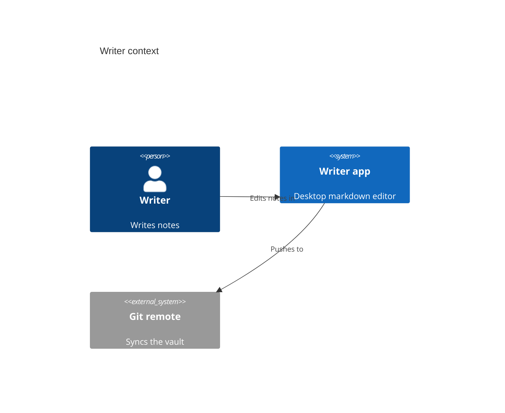
```mermaid
C4Context
  title Writer context
  Person(writer, "Writer", "Writes notes")
  System(app, "Writer app", "Desktop markdown editor")
  System_Ext(git, "Git remote", "Syncs the vault")
  Rel(writer, app, "Edits notes in")
  Rel(app, git, "Pushes to")
```

## Packet

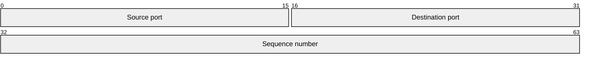
```mermaid
packet-beta
  0-15: "Source port"
  16-31: "Destination port"
  32-63: "Sequence number"
```

## Radar

```mermaid
radar-beta
  title Editor qualities
  axis Speed, Theming, Size, Coverage, Layout
  curve pele["Pele"]{5, 5, 4, 5, 4}
  curve old["beautiful-mermaid"]{4, 3, 3, 2, 4}
```

## Treemap

```mermaid
treemap-beta
"Vault"
  "Notes"
    "Daily": 120
    "Projects": 80
  "Media"
    "Images": 40
```

## Invalid: syntax error

```mermaid
flowchart TD
  A --> B -->
  C[[[ broken
```

## Invalid: unknown diagram type

```mermaid
zenuml
  Alice->Bob: hi
```

## Large flowchart

```mermaid
flowchart TD
  start([Open note]) --> parse[Parse markdown]
  parse --> tree{Tree ready?}
  tree -- no --> force[Force parse] --> tree
  tree -- yes --> deco[Build decorations]
  deco --> fence{Mermaid fence?}
  fence -- no --> text[Render text]
  fence -- yes --> closed{Closed?}
  closed -- no --> source[Leave as source]
  closed -- yes --> cache{In cache?}
  cache -- yes --> mount[Mount canvas]
  cache -- no --> render[Pele render]
  render --> ok{Rendered?}
  ok -- no --> err[Error state]
  ok -- yes --> sanitize[DOMPurify]
  sanitize --> store[Cache SVG] --> mount
  mount --> fit[Fit to viewport]
  fit --> pan[Pan and zoom]
  fit --> edit[Edit source]
  edit --> write[Write fence back] --> parse
  fit --> full[Fullscreen]
  full --> close[Close] --> fit
  err --> edit
  text --> done([Done])
  source --> done
  pan --> done
  subgraph Theme
    light[Light tokens] --> vars[--pele-* variables]
    dark[Dark tokens] --> vars
  end
  vars --> mount
```

## Long sequence

```mermaid
sequenceDiagram
  participant U as User
  participant C as Canvas
  participant R as Renderer
  participant P as Pele
  participant S as Sanitizer
  U->>C: Open note
  C->>R: renderMermaid(source)
  R->>P: render(source)
  P-->>R: svg, width, height
  R->>S: sanitize(svg)
  S-->>R: clean svg
  R-->>C: result
  C->>C: fit to viewport
  U->>C: Drag
  C->>C: pan
  U->>C: Cmd + wheel
  C->>C: zoom at pointer
  U->>C: Edit code
  C->>C: open source panel
  U->>C: Type
  C->>R: renderMermaid(next)
  R->>P: render(next)
  P-->>R: svg
  R-->>C: result
  U->>C: Expand
  C->>C: open fullscreen
  U->>C: Escape
  C->>C: close fullscreen
  U->>C: Switch theme
  Note over C: Colours follow the CSS variables, no re-render
```
